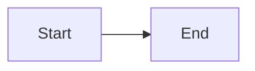

# Contributing to DojoConsortium Documentation

Thank you for your interest in contributing to the DojoConsortium documentation! This guide will help you get started.

## Getting Started

This documentation site is built with [Hugo](https://gohugo.io/) using the [Docsy](https://www.docsy.dev/) theme.

### Prerequisites

- Hugo Extended v0.151.2 or later
- Node.js v22.20.0 (specified in `.nvmrc`)
- npm

### Local Development

1. Clone the repository:
   ```bash
   git clone https://github.com/dojoconsortium/dojoconsortium.org.git
   cd dojoconsortium.org
   ```

2. Install dependencies:
   ```bash
   npm install
   ```

3. Run the development server:
   ```bash
   hugo server
   ```

4. Open your browser to `http://localhost:1313`

## Content Guidelines

### File Organization

Documentation files are located in `content/en/docs/`:

- `cd/` - Continuous Delivery practices and getting started guides
- `work-decomposition/` - Work breakdown and planning
- `workflow-management/` - Team workflow and collaboration
- `testing/` - Test patterns and strategies
- `metrics/` - Measurement and improvement
- `reference/` - Glossary, checklists, and reference materials

### Front Matter

All documentation pages should include front matter with the following fields:

```yaml
---
title: "Clear, Descriptive Title"
linkTitle: "Short Nav Title"  # Optional, defaults to title
weight: <number>              # Required for ordering within section
description: >
  Brief 1-2 sentence summary for SEO and previews.
  Focus on value and key concepts.
tags: ["Category", "Topic", "Related"]
---
```

### Using Hugo Shortcodes

#### Glossary Links

Use the glossary shortcode to link to terms defined in the [glossary](/docs/reference/glossary):

```markdown


```

Examples:
- `` → Links to glossary with term as text
- `` → Links to WIP with custom display text

#### Info Boxes

```markdown
{}
Important information here
{}
```

Colors: `primary`, `info`, `success`, `warning`, `danger`

#### Code Blocks

Use fenced code blocks with language specification:

````markdown
```javascript
const example = "code here";
```
````

#### Diagrams

Use Mermaid for diagrams:

````markdown

````

## Style Guide

### Writing Style

- Use clear, concise language
- Write in second person ("you") when addressing the reader
- Use active voice
- Keep paragraphs short (3-5 sentences)
- Use headings to break up content

### Technical Terms

- Define acronyms on first use
- Link to glossary for standard terms using the `glossary` shortcode
- Be consistent with terminology across pages

### Code Examples

- Provide working, tested examples
- Include comments for complex logic
- Show both the problem and solution
- Support multiple languages where relevant

## Submitting Changes

1. Create a new branch for your changes:
   ```bash
   git checkout -b feature/your-feature-name
   ```

2. Make your changes and test locally with `hugo server`

3. Commit your changes with a descriptive message:
   ```bash
   git add .
   git commit -m "Add section on X topic"
   ```

4. Push to your fork and create a pull request

## Questions?

- Open an issue for bugs or suggestions
- Check existing documentation in `content/en/docs/`
- Review the [Hugo documentation](https://gohugo.io/documentation/)
- Review the [Docsy documentation](https://www.docsy.dev/docs/)
