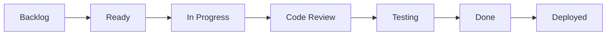
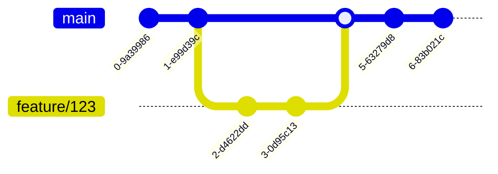
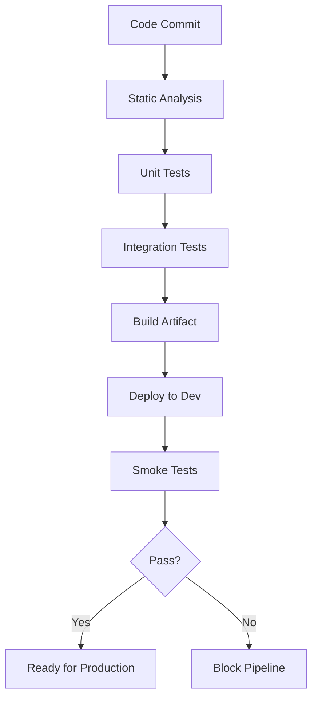

# Documentation Improvement Roadmap

**Repository:** dojoconsortium.org
**Last Updated:** 2025-10-20
**Documentation Path:** `/content/en/docs`

---

## Executive Summary

The DojoConsortium documentation is **well-structured and technically sound** (7/10 rating). This document outlines a roadmap to improve **discoverability**, **consistency**, and **completeness** to bring it to 9/10.

**Current State:**
- ✅ 55 markdown files across 5 main sections
- ✅ Strong technical content with deep expertise
- ✅ Good use of Hugo shortcodes and features
- ⚠️ Inconsistent front matter and navigation
- ⚠️ Missing cross-references between topics
- ⚠️ Limited "getting started" guidance

**Total Improvement Effort:** 32-41 hours across 15 tasks

---

## Completed Improvements

### ✅ Getting Started Guides (Priority 2)

**Completed:** 2025-10-20

**What was added:**

1. **CD Getting Started Guide** (`content/en/docs/cd/getting-started.md`)
   - 405 lines
   - Week 1-4 action plan
   - Day-by-day practical steps
   - 12+ code examples
   - Common challenges & solutions

2. **Testing Quickstart Guide** (`content/en/docs/testing/testing-quickstart.md`)
   - 545 lines
   - 5-day test suite transformation
   - Multi-language examples (JS/Java/Python/Go/C#)
   - 20+ code examples
   - TDD introduction
   - Flaky test elimination strategies

3. **Metrics Quickstart Guide** (`content/en/docs/metrics/metrics-quickstart.md`)
   - 595 lines
   - DORA metrics implementation
   - Day 1 tracking setup
   - Multiple dashboard options
   - 15+ code examples
   - Complete automation script

4. **Cross-references added** to section indexes:
   - `content/en/docs/cd/_index.md`
   - `content/en/docs/testing/_index.md`
   - `content/en/docs/metrics/_index.md`

**Impact:** Addresses the #1 gap - practical "Day 1" guidance for teams starting their CD journey.

**Total Content Added:** 1,545 lines of documentation with 47+ code examples

---

## Priority 1: Critical (Fix Now)

### 1.1 Fix Navigation Weight Conflicts

**Status:** Not Started
**Effort:** 10 minutes
**Impact:** Critical - Clear navigation flow

**Problem:**
- Three sections have identical `weight: 3` (Testing, Metrics, Workflow)
- Causes unpredictable menu ordering
- Confusing user experience

**Solution:**

Update section weights to create logical flow:

```yaml
# content/en/docs/cd/_index.md
weight: 1  # Start here

# content/en/docs/work-decomposition/_index.md
weight: 2  # Plan work

# content/en/docs/workflow-management/_index.md
weight: 3  # Execute work

# content/en/docs/testing/_index.md
weight: 4  # Verify work

# content/en/docs/metrics/_index.md
weight: 5  # Measure work
```

**Files to modify:**
- `content/en/docs/cd/_index.md`
- `content/en/docs/work-decomposition/_index.md`
- `content/en/docs/workflow-management/_index.md`
- `content/en/docs/testing/_index.md`
- `content/en/docs/metrics/_index.md`

**Success Criteria:**
- [ ] All sections have unique weights
- [ ] Navigation menu shows logical progression
- [ ] Order matches learning path (Plan → Execute → Verify → Measure)

---

### 1.2 Add Missing Front Matter

**Status:** Not Started
**Effort:** 2-3 hours
**Impact:** High - SEO, search, consistency

**Problem:**
- Only 37/55 files (67%) have explicit `weight` values
- Only 10/55 files (18%) have `description` metadata
- Inconsistent tag usage across sections
- Poor search engine optimization
- Missing context for search features

**Solution:**

Standardize front matter across all files:

```yaml
---
title: "Clear, Descriptive Title"
linkTitle: "Short Nav Title"  # Optional
weight: <number>              # Required for ordering
description: >
  Brief 1-2 sentence summary that appears in search results
  and social media previews. Focus on value and key concepts.
tags: ["Category", "Topic", "Related"]
type: docs                     # If not default
---
```

**Files needing weight:** ~18 files
**Files needing description:** ~45 files

**Tag Standardization:**

| Section | Standard Tags |
|---------|--------------|
| CD | `["CD", "Getting Started"]` or `["CD", "Advanced"]` |
| Metrics | `["Metrics", "CD"]` or `["Metrics", "Flow"]` |
| Testing | `["Testing", "Quality", "CI"]` |
| Work Decomposition | `["Work Decomposition", "Planning"]` |
| Workflow | `["Workflow", "Team", "Collaboration"]` |

**Success Criteria:**
- [ ] 100% of files have `weight` defined
- [ ] 100% of files have `description` defined
- [ ] All files have at least 2 relevant tags
- [ ] Tag usage is consistent within sections

---

### 1.3 Integrate Orphaned Root Files

**Status:** Not Started
**Effort:** 1 hour
**Impact:** Medium-High - Better organization

**Problem:**
- 4 important files at repository root level
- Not integrated into navigation structure
- Hard to discover
- Breaks expected documentation hierarchy

**Current orphaned files:**
- `content/en/docs/glossary.md`
- `content/en/docs/vsm.md`
- `content/en/docs/cloud-checklist.md`
- `content/en/docs/dora-recommendations.md`

**Solution:**

Create a "Reference" section and reorganize:

```bash
# 1. Create reference section
mkdir -p content/en/docs/reference

# 2. Create reference section index
cat > content/en/docs/reference/_index.md <<EOF
---
title: "Reference Materials"
linkTitle: "Reference"
weight: 6
description: >
  Glossaries, checklists, and reference materials for CD practices
tags: ["Reference"]
---

Quick reference materials and supporting documentation.

## Available References

- [Glossary](/docs/reference/glossary) - Key terms and definitions
- [Value Stream Mapping](/docs/reference/value-stream-mapping) - VSM guide
- [Cloud Checklist](/docs/reference/cloud-checklist) - Cloud readiness
- [DORA Recommendations](/docs/cd/dora-recommendations) - Research-backed practices
EOF

# 3. Move files to appropriate locations
mv content/en/docs/glossary.md content/en/docs/reference/glossary.md
mv content/en/docs/vsm.md content/en/docs/reference/value-stream-mapping.md
mv content/en/docs/cloud-checklist.md content/en/docs/reference/cloud-checklist.md
mv content/en/docs/dora-recommendations.md content/en/docs/cd/dora-recommendations.md

# 4. Update weights in moved files
# reference/glossary.md: weight: 1
# reference/value-stream-mapping.md: weight: 2
# reference/cloud-checklist.md: weight: 3
# cd/dora-recommendations.md: weight: 5
```

**Files to create:**
- `content/en/docs/reference/_index.md`

**Files to move:**
- `glossary.md` → `reference/glossary.md`
- `vsm.md` → `reference/value-stream-mapping.md`
- `cloud-checklist.md` → `reference/cloud-checklist.md`
- `dora-recommendations.md` → `cd/dora-recommendations.md`

**Files to update:**
- Any internal links pointing to old paths

**Success Criteria:**
- [ ] Reference section created and visible in navigation
- [ ] All 4 files successfully moved
- [ ] Internal links updated (run link checker)
- [ ] Files appear in correct menu order

---

## Priority 2: High (Next Sprint)

### 2.1 Improve Cross-Referencing

**Status:** Partially Complete
**Effort:** 2-3 hours
**Impact:** High - Knowledge discovery

**Completed:**
- ✅ Getting started guides linked from section indexes

**Problem:**
- Limited internal linking between related concepts
- Readers must search to find related information
- Difficult to navigate between complementary topics
- Missed learning opportunities

**Solution:**

Add strategic cross-references in these areas:

**Metrics → Testing:**
```markdown
# In: content/en/docs/metrics/development-cycle-time.md
## Related Topics
- [Story Slicing](/docs/work-decomposition/story-slicing) - Reduce cycle time by breaking work smaller
- [Testing Best Practices](/docs/testing/best-practices) - Speed up feedback with better tests
```

**Work Decomposition → Workflow:**
```markdown
# In: content/en/docs/work-decomposition/story-slicing.md
## Related Topics
- [Branching Strategy](/docs/workflow-management/branching) - How to integrate sliced stories
- [Limiting WIP](/docs/workflow-management/limiting-wip) - Keep focus on completing work
```

**CD → Testing:**
```markdown
# In: content/en/docs/cd/_index.md
## Related Topics
- [Testing Patterns](/docs/testing) - Build quality into your pipeline
- [Integration Testing](/docs/testing/integration) - Critical for CD success
```

**Testing → Metrics:**
```markdown
# In: content/en/docs/testing/integration.md
## Related Topics
- [Build Duration](/docs/metrics/build-duration) - Keep your test suite fast
- [Code Coverage](/docs/metrics/code-coverage) - Measure test effectiveness (carefully)
```

**Target:** Add 20-25 strategic cross-reference links

**Files to update:** ~20 files

**Success Criteria:**
- [ ] All metrics pages link to related practices
- [ ] All practice pages link to relevant metrics
- [ ] Work decomposition links to workflow
- [ ] Testing links to CD practices
- [ ] Each page has 2-3 related topic links

---

### 2.2 Add Practical Examples

**Status:** Not Started
**Effort:** 4-6 hours
**Impact:** High - Faster implementation

**Problem:**
- Strong theoretical foundation
- Limited code/configuration examples
- Teams struggle to translate concepts to implementation
- Missing framework-specific guidance

**Solution:**

Add practical examples to key areas:

**Testing Section:**

```markdown
# Add to: content/en/docs/testing/unit.md
## Example: JavaScript/Jest

## Example: Java/JUnit

## Example: Python/pytest

# Add to: content/en/docs/testing/integration.md
## Example: Node.js with Supertest

## Example: Spring Boot with @WebMvcTest

## Example: Django with TestCase
```

**CD Section:**

```markdown
# Add to: content/en/docs/cd/getting-started.md (already has examples!)

# Create new: content/en/docs/cd/pipeline-examples.md
## GitHub Actions Pipeline

## GitLab CI Pipeline

## Jenkins Pipeline

## Azure DevOps Pipeline
```

**Workflow Section:**

```markdown
# Add to: content/en/docs/workflow-management/branching.md
## Visual: Trunk-Based Development Flow (Mermaid diagram)

## Example: Git Commands for TBD

## Example: PR Template

## Example: .gitignore for TBD
```

**Files needing examples:**
- `testing/unit.md`
- `testing/integration.md`
- `testing/functional.md`
- `testing/contract.md`
- `cd/delivery-system-improvement-journey.md`
- `workflow-management/branching.md`
- `workflow-management/code-review.md`

**Success Criteria:**
- [ ] Each test type has code examples in 3+ languages
- [ ] CD section has pipeline examples for 4 major platforms
- [ ] Workflow section has visual diagrams
- [ ] All examples are copy-paste ready
- [ ] Examples follow current best practices (2025)

---

### 2.3 Create Glossary Cross-Links

**Status:** Not Started
**Effort:** 3 hours (manual) or 6 hours (automated)
**Impact:** Medium-High - Easier learning

**Problem:**
- Technical terms used throughout documentation
- No links to glossary definitions
- New readers struggle with acronyms (WIP, TDD, BDD, CI, CD, etc.)
- Terms defined in multiple places inconsistently

**Solution Options:**

**Option 1: Manual Links** (Simple, 3 hours)
```markdown
# Find and link first occurrence of terms
The team should limit [WIP](/docs/reference/glossary#wip) to reduce...
```

**Option 2: Hugo Shortcode** (Better, 4 hours)
```html
<!-- Create: layouts/shortcodes/glossary.html -->
<a href="/docs/reference/glossary#{{ .Get 0 }}" class="glossary-term" title="See glossary definition">{{ .Get 1 | default (.Get 0) }}</a>

<!-- Usage in content: -->
The team should limit  to reduce...
```

**Option 3: Automated** (Best, 6 hours)
```javascript
// Build script that auto-links first occurrence of glossary terms
// in each page without requiring manual markup
```

**Glossary Terms to Link:**
- WIP (Work In Progress)
- TDD (Test-Driven Development)
- BDD (Behavior-Driven Development)
- CI (Continuous Integration)
- CD (Continuous Delivery/Deployment)
- MTTR (Mean Time To Repair)
- Trunk-Based Development
- Feature Flag
- Story Points
- Vertical Sliced Story
- Toil
- Unplanned Work

**Recommended Approach:** Start with Option 2 (Hugo shortcode)

**Success Criteria:**
- [ ] Glossary shortcode created
- [ ] First occurrence of key terms linked in major pages
- [ ] Glossary has 20+ terms defined
- [ ] Terms alphabetically organized
- [ ] Each term has example usage

---

### 2.4 Expand Sparse Section Indexes

**Status:** Not Started
**Effort:** 2 hours
**Impact:** Medium - Better section overviews

**Problem:**
- Some section landing pages are too brief
- `work-decomposition/_index.md` only 19 lines
- Missing context for what section covers
- No guidance on reading order within section

**Solution:**

**Expand `content/en/docs/work-decomposition/_index.md`:**

```markdown
---
title: "Work Decomposition"
linkTitle: "Work Decomposition"
weight: 2
description: >
  Breaking down work to enable small batch delivery, faster feedback,
  and predictable outcomes through story slicing and clear acceptance criteria.
tags: ["Work Decomposition", "Planning"]
---

{}
Reducing batch size is one of the most impactful improvements teams can make.
Small, well-defined work items lead to faster delivery, higher quality, and
better team predictability.
{}

## Why Work Decomposition Matters

Large stories and epics hide complexity, dependencies, and risk. When we break
work into smaller increments, we:

- **Reduce assumptions** - Defining testable acceptance criteria exposes questions
- **Limit hope creep** - We know within a day if we bit off too much
- **Enable pivoting** - Less sunk cost means easier course correction
- **Improve predictability** - Consistent delivery of small items builds trust
- **Reset expectations** - What we thought was "small" is often massive

### The Cost of Large Batches

- Long cycle times (weeks instead of days)
- Late discovery of problems
- Difficulty estimating accurately
- Wasted effort when requirements change
- Context switching while waiting

## Common Problems with Work Breakdown

Teams often struggle with:

- Stories without testable acceptance criteria
- Stories too large (5-10 days of work)
- No Definition of Ready
- Work refined too far in advance (aging like milk)
- Dependencies on other teams

See [Common Blockers](/docs/cd/cd-problems#work-breakdown) for detailed solutions.

## Work Decomposition Practices

The following playbooks help teams deliver smaller batches:

### Getting Started

1. **[Definition of Ready](/docs/work-decomposition/definition-of-ready)** - Start here
2. **[Behavior-Driven Development](/docs/work-decomposition/behavior-driven-development)** - Testable acceptance criteria
3. **[Story Slicing](/docs/work-decomposition/story-slicing)** - Breaking work smaller

### Advanced Techniques

4. **[Task Decomposition](/docs/work-decomposition/task-decomposition)** - Breaking stories into tasks
5. **[Contract-Driven Development](/docs/work-decomposition/contract-driven-development)** - API-first approach
6. **[Spikes](/docs/work-decomposition/spikes)** - Handling uncertainty

### Planning

7. **[Defining Product Goals](/docs/work-decomposition/defining-product-goals)** - Alignment
8. **[Program to User](/docs/work-decomposition/program-to-user)** - Value stream thinking
9. **[Work Breakdown](/docs/work-decomposition/work-breakdown)** - Overall strategy

## Target: Stories Delivered in < 2 Days

All completed work should go from "In Progress" to "In Production" in less than
two days. This forces:

- Clear acceptance criteria
- Reduced scope
- Better decomposition
- Faster feedback

## Related Topics

- [Development Cycle Time](/docs/metrics/development-cycle-time) - Measure your improvement
- [Branching Strategy](/docs/workflow-management/branching) - Integrate small changes frequently
- [Limiting WIP](/docs/workflow-management/limiting-wip) - Finish work before starting new

## Further Reading

- [Story Splitting Flowchart](https://www.humanizingwork.com/the-humanizing-work-guide-to-splitting-user-stories/)
- [Example Mapping](https://cucumber.io/blog/bdd/example-mapping-introduction/)
- [INVEST Criteria](https://www.agilealliance.org/glossary/invest/)
```

**Expand `content/en/docs/workflow-management/_index.md`:**

```markdown
---
weight: 3
title: Team Workflow
linkTitle: "Workflow Management"
description: >
  How teams collaborate to move work from backlog to production
  as rapidly as possible while maintaining quality and reducing WIP.
tags: ["Workflow", "Team", "Collaboration"]
---

{}
Effective workflow management means the team collaborates to deliver value
rapidly, avoiding work assignment silos and prioritizing completion over starting new work.
{}

## Overview

Working together as a team is how we move things from "In Progress" to "Done"
as rapidly as possible in value sequence. It's important for minimizing WIP
that the team looks at the backlog as shared work, not pre-assigned tasks.

## The Three Activities

### 1. Make Work Visible

To create and maintain flow of delivery, we need:

- [Definition of Done](/docs/workflow-management/definition-of-done)
- [A way to visualize the workflow](/docs/workflow-management/visualizing-workflow)
- Prioritized backlog that hasn't been refined too far ahead

### 2. Do Work

Completed work meets the [Definition of Ready](/docs/work-decomposition/definition-of-ready)
when work begins, the [Definition of Done](/docs/workflow-management/definition-of-done)
when work is delivered, and can be completed in less than two days.

**Common workflow smells:**
- Context switching
- Ineffective demos that prevent early feedback
- Multiple teams own pieces of the process
- [Status unclear](/docs/workflow-management/visualizing-workflow)
- Siloed work on the team
- [Too much WIP](/docs/workflow-management/limiting-wip)

### 3. Improve Work

An [improvement process](/docs/cd/delivery-system-improvement-journey#3-continuous-improvement)
must be in place, centered around feedback loops.

**Common improvement challenges:**
- Infrequent or nonexistent demos
- [Ineffective retrospectives](/docs/workflow-management/retrospective)
- No action on improvement items

## Workflow Best Practices

### Source Control

- [Branching Strategy](/docs/workflow-management/branching) - Trunk-based development
- [Source Ownership](/docs/workflow-management/source-ownership) - Collective ownership
- [Code Review](/docs/workflow-management/code-review) - Lean review process

### Team Practices

- [Limiting WIP](/docs/workflow-management/limiting-wip) - Finish before starting
- [Unplanned Work](/docs/workflow-management/unplanned-work) - Handle interruptions
- [Retrospective](/docs/workflow-management/retrospective) - Continuous improvement

## Measuring Workflow

Key metrics for workflow effectiveness:

- [WIP](/docs/metrics/work-in-progress) - Work in progress count
- [Development Cycle Time](/docs/metrics/development-cycle-time) - Start to production
- [Lead Time](/docs/metrics/lead-time) - Request to delivery
- [Velocity](/docs/metrics/velocity) - Work completed per iteration

## Anti-Patterns

- Assigning tasks at sprint planning
- Multiple feature branches
- Long-lived branches (> 1 day)
- Handoffs between teams
- Waiting on approvals
- Manual quality gates

## Related Topics

- [Work Decomposition](/docs/work-decomposition) - Break work small enough
- [Testing Patterns](/docs/testing) - Build quality in
- [CI Working Agreement](/docs/cd#continuous-integration-ci) - Integration practices

## Further Reading

- [Making Work Visible](https://learning.oreilly.com/library/view/making-work-visible/9781457191428/) - Dominica DeGrandis
- [The Phoenix Project](https://learning.oreilly.com/library/view/the-phoenix-project/9781457191350/) - Gene Kim et al
```

**Success Criteria:**
- [ ] work-decomposition/_index.md expanded to 150+ lines
- [ ] workflow-management/_index.md expanded to 150+ lines
- [ ] Both include clear section overviews
- [ ] Reading order guidance provided
- [ ] Common problems documented
- [ ] Related topics linked

---

## Priority 3: Medium (Future Enhancement)

### 3.1 Add Visual Diagrams

**Status:** Not Started
**Effort:** 6-8 hours
**Impact:** Medium - Visual learning

**Problem:**
- Only 3 diagrams currently (CD Pipeline, Test Pyramid, Ice Cream Cone)
- Many concepts would benefit from visualization
- Mermaid support built into Hugo but underutilized

**Solution:**

Create Mermaid diagrams for:

**1. Workflow States (Kanban Flow)**

Location: `workflow-management/visualizing-workflow.md`

**2. Value Stream Map Example**

Location: `reference/value-stream-mapping.md`

**3. Branch Lifecycle (Trunk-Based Development)**

Location: `workflow-management/branching.md`

**4. Test Execution Flow**

Location: `testing/_index.md`

**5. CI/CD Pipeline Stages**

Location: `cd/getting-started.md` (already has text, add diagram)

**6. Dependency Tree** (Already exists but is draft)
- File: `cd/cd-dependency-tree.md` (currently `draft: true`)
- Action: Publish by removing draft flag
- Already has comprehensive Mermaid diagram

**Success Criteria:**
- [ ] 6 new Mermaid diagrams added
- [ ] All diagrams render correctly in Hugo
- [ ] Diagrams enhance understanding (not just decoration)
- [ ] Diagrams are accessible (alt text, descriptions)

---

### 3.2 Create Topic Indexes

**Status:** Not Started
**Effort:** 4 hours
**Impact:** Medium - Better reference

**Problem:**
- Patterns mentioned throughout but no consolidated list
- Anti-patterns documented but not indexed
- Tools mentioned but not cataloged
- Hard to find "all the ways to solve X"

**Solution:**

Create three reference pages:

**1. Patterns Index** (`content/en/docs/reference/patterns.md`)

```markdown
---
title: "Pattern Catalog"
weight: 4
description: >
  Catalog of all patterns referenced in the documentation with usage guidance
tags: ["Reference", "Patterns"]
---

## Development Patterns

- **Test-Driven Development (TDD)** - Write tests first
  - When: Developing new features
  - See: [TDD Resources](/docs/_index.md#test-driven-development)

- **Behavior-Driven Development (BDD)** - Define testable acceptance criteria
  - When: Defining new stories
  - See: [BDD](/docs/work-decomposition/behavior-driven-development)

- **Trunk-Based Development** - Short-lived branches, frequent integration
  - When: Always (this is the way)
  - See: [Branching](/docs/workflow-management/branching)

[... continue for all patterns ...]
```

**2. Anti-Patterns Index** (`content/en/docs/reference/anti-patterns.md`)

```markdown
---
title: "Anti-Pattern Catalog"
weight: 5
description: >
  Common anti-patterns to avoid and how to recognize them
tags: ["Reference", "Anti-Patterns"]
---

## Testing Anti-Patterns

- **Ice Cream Cone Testing** - Too many E2E tests, not enough unit/integration
  - Warning Signs: Test suite takes 30+ minutes, flaky tests
  - Fix: Convert E2E to integration tests
  - See: [Testing Patterns](/docs/testing#testing-anti-patterns)

[... continue for all anti-patterns ...]
```

**3. Tools Catalog** (`content/en/docs/reference/tools.md`)

```markdown
---
title: "Tool Recommendations"
weight: 6
description: >
  Tools mentioned throughout the documentation organized by category and language
tags: ["Reference", "Tools"]
---

## Testing Tools

### JavaScript/TypeScript
- **Frameworks:** Jest, Vitest, Mocha
- **Integration:** Supertest, Testcontainers
- **E2E:** Playwright, Cypress
- **Mocking:** Nock, MSW

### Java
- **Frameworks:** JUnit 5, TestNG
- **Integration:** Spring Test, Testcontainers
- **Mocking:** Mockito, WireMock

[... continue for all languages and categories ...]
```

**Success Criteria:**
- [ ] All patterns documented in one place
- [ ] All anti-patterns with solutions
- [ ] Tools organized by language/framework
- [ ] Each entry links to detailed documentation
- [ ] Searchable and browsable

---

### 3.3 Standardize Page Structure

**Status:** Not Started
**Effort:** Create template (1 hour) + apply gradually
**Impact:** Medium - Consistency

**Problem:**
- Inconsistent section organization across pages
- Some pages very detailed, others sparse
- Readers don't know what to expect
- Writers don't have template to follow

**Solution:**

Create a documentation template and apply gradually to new pages:

**Template:** `CONTENT_TEMPLATE.md`

```markdown
---
title: "Topic Name"
linkTitle: "Short Name"  # Optional
weight: <number>
description: >
  Brief 1-2 sentence summary describing what this page covers
  and why it matters. Optimize for search engines and social media.
tags: ["Category", "Relevant", "Tags"]
type: docs  # Usually default
---

{}
One sentence elevator pitch: What this topic is and why you should care.
{}

## Overview

2-3 paragraphs explaining:
- What this topic/practice/pattern is
- When you would use it
- Who it's for

## Why It Matters

Business and technical value:
- Impact on delivery speed
- Quality improvements
- Team benefits
- Organizational outcomes

## How to Implement

Step-by-step guidance:

### Prerequisites
What you need before starting

### Step 1: [First Action]
Detailed instructions

### Step 2: [Second Action]
Detailed instructions

### Step 3: [Third Action]
Detailed instructions

## Best Practices

### Do:
- Recommended approaches
- Proven patterns
- Success criteria

### Don't:
- Anti-patterns to avoid
- Common mistakes
- Warning signs

## Common Pitfalls

Challenges teams face and how to overcome them:

### Pitfall 1: [Problem]
**Symptoms:** What you'll see
**Solution:** How to fix

### Pitfall 2: [Problem]
**Symptoms:** What you'll see
**Solution:** How to fix

## Examples

Practical, copy-paste ready examples:

### Example 1: [Use Case]
\`\`\`language
// Code example
\`\`\`

### Example 2: [Use Case]
\`\`\`language
// Code example
\`\`\`

## Related Topics

- [Related Topic 1](/docs/path) - Why it's related
- [Related Topic 2](/docs/path) - Why it's related
- [Related Topic 3](/docs/path) - Why it's related

## Further Reading

External resources:
- [Article Title](URL) - Brief description
- [Book Title](URL) - Brief description
- [Video Title](URL) - Duration

---

## Questions?

Common questions about this topic:

**Q: [Question]**
A: [Answer]

**Q: [Question]**
A: [Answer]
```

**Application Strategy:**
- Use for all new pages immediately
- Gradually retrofit existing pages during updates
- Not all sections required (adapt as needed)
- Focus on consistency within sections first

**Success Criteria:**
- [ ] Template documented
- [ ] Shared with contributors
- [ ] New pages follow template
- [ ] At least 10 existing pages retrofitted

---

### 3.4 Enhance Hugo Taxonomy

**Status:** Not Started
**Effort:** 3 hours
**Impact:** Medium - Better browsing

**Problem:**
- Tags exist but inconsistently applied
- No categories taxonomy
- Can't browse by topic
- Can't filter by level (Getting Started vs Advanced)

**Solution:**

**1. Enable Categories in Hugo Config:**

```toml
# hugo.toml
[taxonomies]
  tag = "tags"
  category = "categories"
```

**2. Define Standard Categories:**

```yaml
# Add to front matter:

categories: ["Getting Started"]  # Introductory content
categories: ["Core Practices"]   # Essential day-to-day practices
categories: ["Advanced"]         # Deep technical content
categories: ["Reference"]        # Glossaries, checklists, catalogs
categories: ["Leadership"]       # Content for managers/leadership
```

**3. Standardize Tags:**

| Section | Required Tags | Optional Tags |
|---------|--------------|---------------|
| CD | `["CD"]` | `["Getting Started", "Advanced", "Pipeline"]` |
| Metrics | `["Metrics"]` | `["Flow", "Quality", "Throughput"]` |
| Testing | `["Testing"]` | `["CI", "Quality", "TDD", "BDD"]` |
| Work Decomp | `["Work Decomposition"]` | `["Planning", "BDD", "Agile"]` |
| Workflow | `["Workflow"]` | `["Team", "Collaboration", "Git"]` |

**4. Create Tag/Category Pages:**

Hugo automatically generates these, but customize:

```markdown
# layouts/taxonomy/tag.html
# layouts/taxonomy/category.html
```

**5. Add Tag/Category Navigation:**

```markdown
# Add to layouts/partials/sidebar.html or navigation
```

**Success Criteria:**
- [ ] Categories enabled in config
- [ ] All pages tagged with section tag
- [ ] All pages categorized by level
- [ ] Tag pages render correctly
- [ ] Category pages render correctly
- [ ] Navigation includes browse-by-topic

---

## Priority 4: Low (Polish & Optimization)

### 4.1 SEO Optimization

**Status:** Partially Complete (Getting Started guides done)
**Effort:** 2-3 hours
**Impact:** Low-Medium - Discoverability

**Current State:**
- 10/55 files (18%) have descriptions
- Getting Started guides (3 files) have complete SEO metadata
- No OpenGraph/Twitter Card tags
- Missing structured data

**Solution:**

**1. Complete Description Fields:**
- Add to remaining 42 files
- Follow format: Action-oriented, value-focused, 120-160 characters

**2. Add Social Media Tags:**

```yaml
# In section index pages:
images: ["/images/cd-pipeline.png"]  # OpenGraph image

# Create: layouts/partials/head-end.html
<meta property="og:title" content="{{ .Title }}" />
<meta property="og:description" content="{{ .Description }}" />
<meta property="og:image" content="{{ .Params.images | default site.Params.images }}" />
<meta name="twitter:card" content="summary_large_image" />
```

**3. Add Structured Data (optional):**

```html
<!-- JSON-LD for documentation -->
<script type="application/ld+json">
{
  "@context": "https://schema.org",
  "@type": "TechArticle",
  "headline": "{{ .Title }}",
  "description": "{{ .Description }}",
  "author": {
    "@type": "Organization",
    "name": "DevOps Dojo Consortium"
  }
}
</script>
```

**Success Criteria:**
- [ ] 100% of files have descriptions
- [ ] Section indexes have OpenGraph tags
- [ ] Social sharing shows correct preview
- [ ] Google Search Console shows improved snippets

---

### 4.2 Enable Table of Contents

**Status:** Not Started
**Effort:** 30 minutes
**Impact:** Low - Navigation on long pages

**Problem:**
- Long pages (100+ lines) hard to navigate
- No jump-to-section functionality
- Desktop screen real estate underutilized

**Solution:**

Add TOC to long pages:

```yaml
---
title: "Long Page Title"
toc: true  # Add this
---
```

**Target pages:**
- `docs/_index.md` (116 lines)
- `cd/cd-problems.md` (100+ lines)
- `testing/_index.md` (52 lines)
- All Getting Started guides (already long)
- Any page > 50 lines

**Docsy theme automatically renders TOC in sidebar when enabled.**

**Success Criteria:**
- [ ] TOC enabled on 10+ long pages
- [ ] TOC renders in sidebar
- [ ] Jump links work correctly
- [ ] Mobile experience still good

---

### 4.3 Add Last Updated Dates

**Status:** Not Started
**Effort:** 1 hour (config) + ongoing
**Impact:** Low - Content freshness signal

**Problem:**
- No visibility into when content was last updated
- Readers don't know if information is current
- No incentive to keep content fresh

**Solution:**

**1. Update Hugo Config:**

```toml
# hugo.toml
[frontmatter]
  date = ["date", "publishDate", "lastmod"]
  lastmod = ["lastmod", ":git", "date", "publishDate"]
  publishDate = ["publishDate", "date"]
  expiryDate = ["expiryDate"]
```

**2. Add Dates to Front Matter:**

```yaml
---
title: "Page Title"
date: 2025-10-20
lastmod: 2025-10-20
---
```

**3. Customize Layout to Display:**

```html
<!-- layouts/partials/page-meta.html -->
<div class="page-meta">
  {{ with .Lastmod }}
    <p>Last updated: {{ .Format "January 2, 2006" }}</p>
  {{ end }}
</div>
```

**Success Criteria:**
- [ ] Git-based lastmod enabled
- [ ] Last updated date shows on pages
- [ ] Date format readable
- [ ] Automatic update on file changes

---

### 4.4 Create Contribution Guide

**Status:** Not Started
**Effort:** 2 hours
**Impact:** Low - Community contributions

**Problem:**
- No guidance for contributing improvements
- Unclear documentation standards
- Don't know how to run docs locally
- Discourages community contributions

**Solution:**

Create: `content/en/docs/contributing.md`

```markdown
---
title: "Contributing to Documentation"
weight: 100
description: >
  How to suggest improvements and contribute to the DevOps Dojo documentation
tags: ["Meta", "Contributing"]
---

## How to Contribute

We welcome contributions! Here's how to help improve the documentation.

### Quick Fixes

For typos or small corrections:
1. Click "Edit this page" in the sidebar
2. Make your change in GitHub
3. Submit a Pull Request

### Larger Changes

For new content or significant updates:
1. Open an issue describing the change
2. Wait for approval/discussion
3. Fork the repository
4. Make your changes
5. Submit a Pull Request

## Documentation Standards

### Content Guidelines

- **Be concise** - Value reader's time
- **Be practical** - Include examples and code
- **Be accurate** - Verify technical details
- **Be current** - Reference 2025 best practices

### Style Guide

- Use active voice
- Write in present tense
- Use sentence case for headings
- Limit paragraphs to 3-4 sentences
- Include code examples where possible

### Front Matter Standards

Every page should include:

\`\`\`yaml
---
title: "Clear, Descriptive Title"
weight: <number>
description: >
  Brief 1-2 sentence summary
tags: ["Category", "Tags"]
---
\`\`\`

### Markdown Conventions

- Use `##` for main sections (not `#`)
- Code blocks must specify language
- Links use descriptive text (not "click here")
- Images include alt text
- Use Hugo shortcodes for alerts

## Running Locally

### Prerequisites

- Hugo Extended v0.146.0+
- Go 1.21+
- Node.js 22+

### Setup

\`\`\`bash
# Clone repository
git clone https://github.com/dojo-consortium/dojoconsortium.org
cd dojoconsortium.org

# Install dependencies
npm install

# Download Hugo modules
hugo mod get

# Start development server
hugo server
\`\`\`

Visit: http://localhost:1313

### Building

\`\`\`bash
# Build production site
hugo

# Output in: public/
\`\`\`

## Hugo Shortcodes

We use Docsy theme shortcodes:

### Alerts

\`\`\`markdown
{}
Important information
{}
\`\`\`

Colors: primary, info, warning, danger, success

### Page Info

\`\`\`markdown
{}
Summary of page content
{}
\`\`\`

### Code Blocks

\`\`\`markdown
\`\`\`javascript
const example = "code";
\`\`\`
\`\`\`

## Review Process

1. Automated checks run on PR
2. Maintainer reviews within 1 week
3. Address feedback
4. Merge when approved

## Questions?

- Open an issue on GitHub
- Ask in discussions
- Email: [contact email]

Thank you for helping improve the documentation!
```

**Success Criteria:**
- [ ] Contribution guide created
- [ ] Linked from main navigation or footer
- [ ] Standards documented
- [ ] Local development instructions work
- [ ] Community contributions increase

---

## Content Gaps (Future Work)

### Missing Topics

These topics are referenced but not documented:

- **Feature Flags / Feature Toggles**
  - Mentioned throughout but no dedicated guide
  - Suggested location: `content/en/docs/cd/feature-flags.md`

- **Database Migration Strategies**
  - Critical for CD but not covered
  - Suggested location: `content/en/docs/cd/database-migrations.md`

- **Monitoring & Observability**
  - Complement to metrics section
  - Suggested location: `content/en/docs/observability/_index.md`

- **Security in CD Pipeline**
  - Security scanning, SAST, DAST
  - Suggested location: `content/en/docs/cd/security.md`

- **Remote/Distributed Team Considerations**
  - How practices change for remote teams
  - Suggested location: `content/en/docs/workflow-management/remote-teams.md`

- **Scaling CD to Multiple Teams**
  - Conway's Law in practice
  - Suggested location: `content/en/docs/cd/scaling-cd.md`

- **Legacy System Modernization**
  - Applying CD to legacy systems
  - Suggested location: `content/en/docs/cd/modernization.md`

### Underdeveloped Topics

Topics with pages but needing expansion:

- **Contract Testing** - Has page but could be deeper
- **Cloud Checklist** - Exists but isolated, needs context
- **Retrospectives** - Good page but could add facilitation techniques
- **CD Dependency Tree** - Exists but marked as `draft: true`

---

## Quick Wins

Tasks that can be completed in < 1 hour each:

1. ✅ **Fix navigation weights** (10 min) - HIGHEST PRIORITY
2. ✅ **Add TOC to long pages** (30 min)
3. ✅ **Create reference section structure** (30 min)
4. ✅ **Add 10 strategic cross-links** (30 min)
5. ✅ **Publish cd-dependency-tree.md** (5 min - remove `draft: true`)
6. ✅ **Add descriptions to section indexes** (30 min)
7. ✅ **Add Hugo shortcode for glossary** (30 min)

---

## Recommended Execution Order

### Week 1: Foundation
- [ ] Fix navigation weights (P1.1)
- [ ] Integrate orphaned files (P1.3)
- [ ] Add descriptions to section indexes (P1.2 partial)
- [ ] Publish CD dependency tree diagram

**Effort:** 3-4 hours
**Impact:** Immediate improvement in navigation and discovery

### Week 2: Enhancement
- [ ] Add cross-reference links (P2.1)
- [ ] Expand sparse section indexes (P2.4)
- [ ] Enable TOC on long pages (P4.2)
- [ ] Create glossary cross-links (P2.3)

**Effort:** 7-8 hours
**Impact:** Better knowledge discovery and navigation

### Week 3: Content Addition
- [ ] Add practical examples (P2.2)
- [ ] Create visual diagrams (P3.1)
- [ ] Create topic indexes (P3.2)

**Effort:** 14-18 hours
**Impact:** More actionable, easier to implement

### Week 4: Polish
- [ ] Complete front matter (P1.2 completion)
- [ ] SEO optimization (P4.1)
- [ ] Add last updated dates (P4.3)
- [ ] Contribution guide (P4.4)

**Effort:** 6-8 hours
**Impact:** Professional polish, better SEO

---

## Success Metrics

Track improvement progress:

### Navigation & Discovery
- [ ] Unique navigation weights (all sections)
- [ ] 100% files have descriptions
- [ ] Average page has 3+ internal links
- [ ] Reference section exists and is populated

### Content Completeness
- [ ] Getting Started guides in all major sections ✅
- [ ] All test types have code examples
- [ ] All metrics have implementation guidance
- [ ] Major topics have visual diagrams

### User Experience
- [ ] Long pages have TOC
- [ ] Glossary terms are linked
- [ ] Related topics are cross-referenced
- [ ] Contribution guide exists

### SEO & Discoverability
- [ ] All pages have meta descriptions
- [ ] Social media tags configured
- [ ] Search console shows improved rankings
- [ ] Lower bounce rate (if analytics available)

---

## Maintenance

### Regular Reviews

**Monthly:**
- Review analytics for popular pages
- Update examples for current tool versions
- Check for broken external links
- Address community contributions

**Quarterly:**
- Review all dates and tool versions
- Update screenshots if UI changed
- Review and update metrics targets
- Refresh reading recommendations

**Annually:**
- Major content audit
- Restructure if needed
- Update for new practices/tools
- Archive obsolete content

### Keeping Current

**When tools update:**
- Update version numbers in examples
- Test code examples still work
- Update screenshots
- Note breaking changes

**When practices evolve:**
- Update recommendations
- Add new patterns
- Document migrations
- Maintain backward compatibility notes

---

## Getting Help

**Questions about this roadmap?**
- Open an issue: [GitHub Issues](https://github.com/dojo-consortium/dojoconsortium.org/issues)
- Tag: `documentation`, `improvement`

**Want to contribute?**
- See: [Contributing Guide](#44-create-contribution-guide) (to be created)
- Pick a task marked "Not Started"
- Comment on related issue

**Need clarification?**
- Ask in discussions
- Reference this document
- Tag maintainers

---

**Last Updated:** 2025-10-20
**Document Version:** 1.0
**Status:** Active roadmap

---

*This improvement roadmap is a living document. As improvements are completed, this file should be updated to reflect current status and add new priorities as they emerge.*
