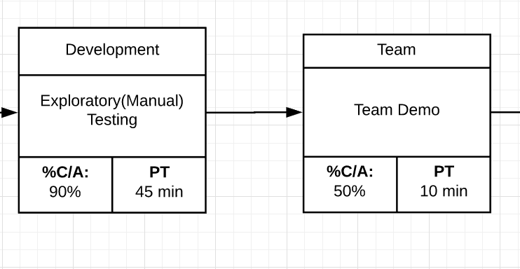
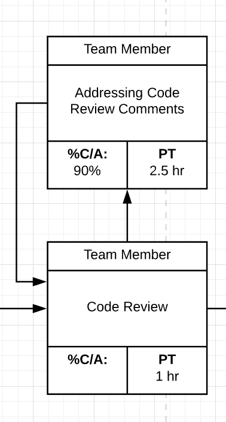
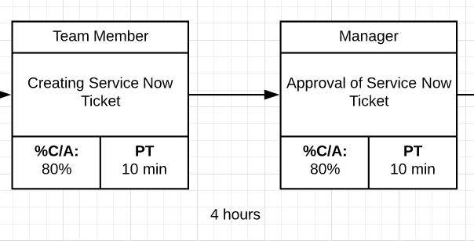
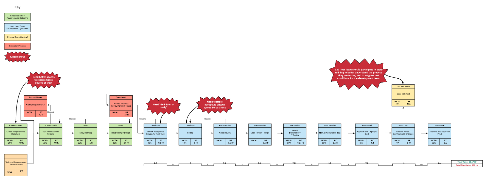

The purpose of Value Stream Mapping Workshop is to understand all of the steps needed to
deliver value from conception to production. We can then use it as a tool to
identify constraints and propose improvements to the value stream.

## Prerequisites

1. Everyone who has a touch point in the value stream should be present for the exercise. This includes, but is not
   limited to developers, managers, product owners, and representatives from external teams that have required steps
   between conception and production.

2. Understand terms associated with value stream mapping.
   - Wait time/non-value time: Time between processes where activity is not occurring.
   - Process time/value add time: Time spent executing a step in the value stream.
   - Percent Complete/Accurate: Percentage of work that is rejected by the next step in the process. i.e. If code fails
     code review 20% of the time, the %C/A is 80%.

## Recommended Practices

When value stream mapping your team, start from production and move backwards each step. You are less likely to miss
steps in the process.

### Identify source of request

_Example_ Team Demo

For each source of _Requests_

- What is the average process time for this step?
- Who is involved in this step?
- What percentage of work is rejected by the next step in the process?

Your team will need to identify these things for each step in the process. Don't forget to identify where your intake
process is originated, whether that be stakeholder conversations, service desk, etc.

### Identify Rework Loops

After your team has completed the initial value stream map, they have most likely identified a few rework loops. Rework
loops are interruptions in the value stream where steps have to be corrected.

In this example, the team had to fix code review comments 10% of the time before it could be reviewed and merged to
master.

### Identify Wait Time

Once your team has completed the above steps, you will go back through the value stream to identify the wait time
between each step in the process. Make sure to take your cadence into account when calculating.

Add your total process time/wait time to get an average lead time. Understand that the value stream is an
estimate/average based on your teams feedback.

## Outcomes

- Process time/wait time of your flow.
- Visual representation of the value stream(s) of the team.
- Possible constraints to your flow based on process time/wait time, rework loops, and percent complete/accurate. You
  can present these on your VSM as kaizen bursts.

## Tips

- Review and maintain value stream map to show wins associated to your team's improvement plan.
- Take into account all potential flows for team processes, and value stream those as well.

## Value

As a team, we want to understand how to value stream map our team processes, so that we may understand our constraints
to delivery and identify ways to improve.

## Acceptance Criteria

- Value stream all things associated to delivering value.
- Create action items of improvement from exercise.

## References

- [Value Stream Mapping Guide](https://creately.com/blog/diagrams/value-stream-mapping-guide/)
- [Value Stream Mapping: How to Visualize Work and Align Leadership for Organizational Transformation](https://learning.oreilly.com/library/view/value-stream-mapping/9780071828918/)
- [Mapping the Improvement Roadmap](https://www.linkedin.com/learning/devops-foundations-transforming-the-enterprise/what-is-a-value-stream-map-vsm):
  8 minutes
