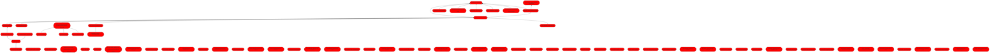

---

title: CD Dependencies
draft: true
tags:
  - CD Dependencies
---

```mermaid
%%{init: {'securityLevel': 'loose', 'theme': 'base', 'themeVariables': { 'primaryColor': '#ff0000'}}}%%
graph BT
TDD([Test Driven Development.])-->CI
BDD([Behavior Driven Development.])-->TDD
TBD([Trunk-based Development.])-->CI
CI([Continuous Integration.])-->CD([Continuous Delivery.])
4-->CI
1([dedicated build server])-->4
2([scripted builds])-->1
3([versioned code base])-->2
4([builds are stored])
CI-->4
5([auto-triggered build])-->CI
2-->6([automated tag & versioning])
CI-->7([pipeline with deploy to prod])
7-->CD
7-->8([build once, auto-deploy anywhere])
9([scripted config changes])-->CD
10([standard process for all envs])-->CD
11([automatic DB deploys])-->CD
12([zero downtime deploys])-->CD
13([zero-touch continuous deployments])-->CD
14([defined & documented product development process])-->CI
15([definition of done])-->14
16([prioritized work])-->14
17([working agreements])-->14
18([adopt basic Agile methods])
19([one backlog per team])
20([remove boundaries between dev, test, & support])
21([share the pain])
22([stable teams])
23([act on build, quality, test, deploy and operational metrics])
24([common process for all changes])
25([component ownership])
26([decentralize decisions])
27([extended team collaboration])
28([frequent commits])
29([dedicated continuous improvement process])
30([dedicated tools team])
31([deploy disconnected from release])
32([team responsible thru release])
33([cross-functional teams])
34([no rollbacks, always roll forward])
35([consolidated platform & tech])
36([automated api management ])
37([library  management])
38([organize system into modules])
39([version control DB changes])
40([branch by abstraction])
41([configuration as code / managed configs])
42([feature hiding / toggling])
43([making components from modules])
44([no long-lived branches, trunk-based development])
45([full component based arch])
46([push business metrics])
47([infrastructure as code])
48([baseline process metrics])
49([manual reporting])
50([measure the process])
51([scheduled quality reports])
52([static code analysis])
53([common information model])
54([report history is available])
55([traceability built into pipeline])
56([dynamic test coverage analysis])
57([graphing as a service])
58([report trend analysis])
59([cross-silo analysis])
60([dynamic graphing and dashboards])
61([automatic unit tests])
62([separate test environment])
63([automatic integration tests])
64([automatic isolated component tests])
65([some automatic acceptance tests])
66([automatic performance tests])
67([automatic security tests])
68([full automatic acceptance tests])
69([risk-based manual testing])
70([hypothesis-driven development])
71([verify expected business value ])

```
